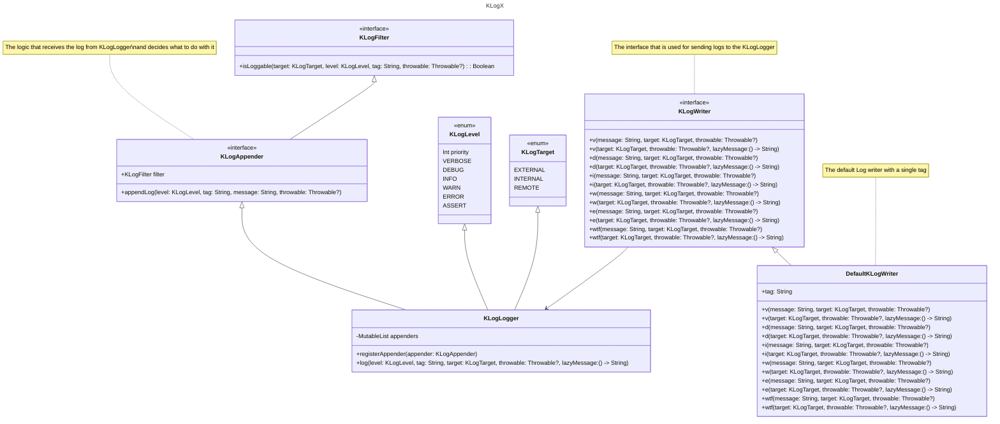

#  KLogX

KLogX is a Kotlin logging library designed to provide a flexible and efficient way to log messages in your application. It supports different log levels and log targets and allows you to register custom appenders to handle log messages based on their filter.


## Features

- Supports multiple log levels: INFO, WARN, ERROR, etc.
- Supports multiple log target: INTERNAL, EXTERNAL, REMOTE.
- Allows lazy message evaluation
- Customizable log targets by filter
- Register custom appenders


## Installation

Add the following dependency to your `build.gradle` file:

```groovy
dependencies {
    implementation 'com.mohsenoid.klogx:core:1.0.0'
}
```

Or use the BOM (Bill of Material) to manage the versions:

```groovy
implementation(platform("com.mohsenoid.klogx:klogx-bom:2024.09.29"))
implementation("com.mohsenoid.klogx:core")
implementation("com.mohsenoid.klogx.android:logcat")
implementation("com.mohsenoid.klogx.android:timber")
implementation("com.mohsenoid.klogx.android:firebase")
implementation("com.mohsenoid.klogx.android:instabug")
```

## Usage

### Basic logging

To log messages, use the `KLogWriter` interface. Here are some examples:

```kotlin
class FeatureXLogWriter : DefaultKLogWriter {
    override val tag: String = "FeatureX"
}

val logWriter = FeatureXLogWriter()

// Info log
logWriter.i("Debugger is active")

// Warning log
logWriter.w("Launch timeout has expired, giving up wake Lock!")

// Error log
logWriter.e("Uncaught handler: thread main exiting due to uncaught exception", throwable = e)

// WTF log
logWriter.wtf("What A Terrible Failure")
```


### Lazy message evaluation

You can also log expensive messages lazily to avoid calculation if they got filtered out:

```kotlin
logWriter.d { "A ${veryExpensiveMessage()}" }
```

## Building blocks




### Log Appenders

You can register log appenders to handle log messages based on the defined filter:

```kotlin
val customAppender = object : KLogAppender {
    override val filter: KLogFilter = CustomLogFilter()

    override fun appendLog(level: KLogLevel, tag: String, message: String, throwable: Throwable?) {
        // Custom log handling
    }
}

KLogLogger.registerAppender(customAppender)
```


### Log Filter

The log filter allows logger to decide if a log should be sent to an appender or not:

```kotlin
class CustomLogFilter : KLogFilter {
    override fun isLoggable(
        target: KLogTarget,
        level: KLogLevel,
        tag: String,
        throwable: Throwable?,
    ): Boolean = level.priority >= KLogLevel.INFO.priority &&
        target == KLogTarget.EXTERNAL &&
        !tag.contains("secret") &&
        throwable !is SecurityException
}
```


### Log Target

The Log target could be used for the internal, external, or remote logs. It is another means of log filtering:

```kotlin
logWriter.w("Launch timeout has expired, giving up wake Lock!", target = KLogTarget.EXTERNAL)
```


## Supported Appenders


### Android Logcat

```groovy
dependencies {
    implementation("com.mohsenoid.klogx.android:logcat:1.0.0")
}
```

Usage:
```kotlin
val logcatLogFilter = SampleLogcatLogFilter()
val logcatLogAppender = KLogLogcatAppender(logcatLogFilter)
KLogLogger.registerAppender(logcatLogAppender)
```


### Android Timber

```groovy
dependencies {
    implementation("com.mohsenoid.klogx.android:timber:1.0.0")
}
```

Usage:
```kotlin
val timberLogFilter = DefaultKLogFilter()
val timberLogAppender = KLogTimberAppender(timberLogFilter)
KLogLogger.registerAppender(timberLogAppender)
```


### Android Firebase

```groovy
dependencies {
    implementation("com.mohsenoid.klogx.android:firebase:1.0.0")
}
```

Usage:

```kotlin
val firebaseLogFilter = SampleFirebaselLogFilter()
val firebaseLogAppender = KLogFirebaseAppender(firebaseLogFilter)
KLogLogger.registerAppender(firebaseLogAppender)
```


### Android Instabug

```groovy
dependencies {
    implementation("com.mohsenoid.klogx.android:instabug:1.0.0")
}
```

```kotlin
val instabugLogFilter = SampleInstabugLogFilter()
val instabugLogAppender = KLogInstabugAppender(instabugLogFilter)
KLogLogger.registerAppender(instabugLogAppender)
```


## License

Copyright 2024 Mohsen Mirhoseini

Licensed under the Apache License, Version 2.0 (the "License");
you may not use this file except in compliance with the License.
You may obtain a copy of the License at

   http://www.apache.org/licenses/LICENSE-2.0

Unless required by applicable law or agreed to in writing, software
distributed under the License is distributed on an "AS IS" BASIS,
WITHOUT WARRANTIES OR CONDITIONS OF ANY KIND, either express or implied.
See the License for the specific language governing permissions and
limitations under the License.
